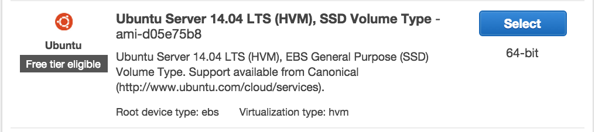
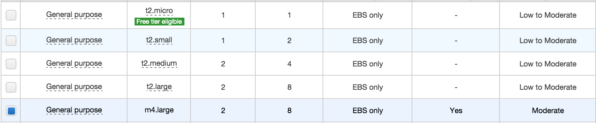
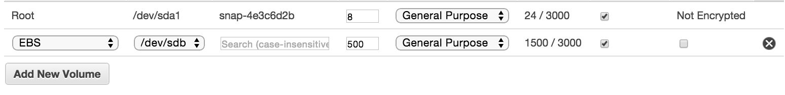
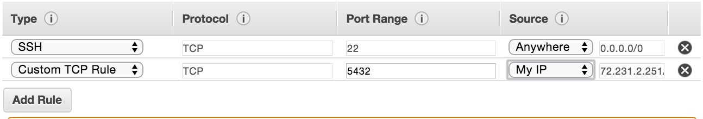
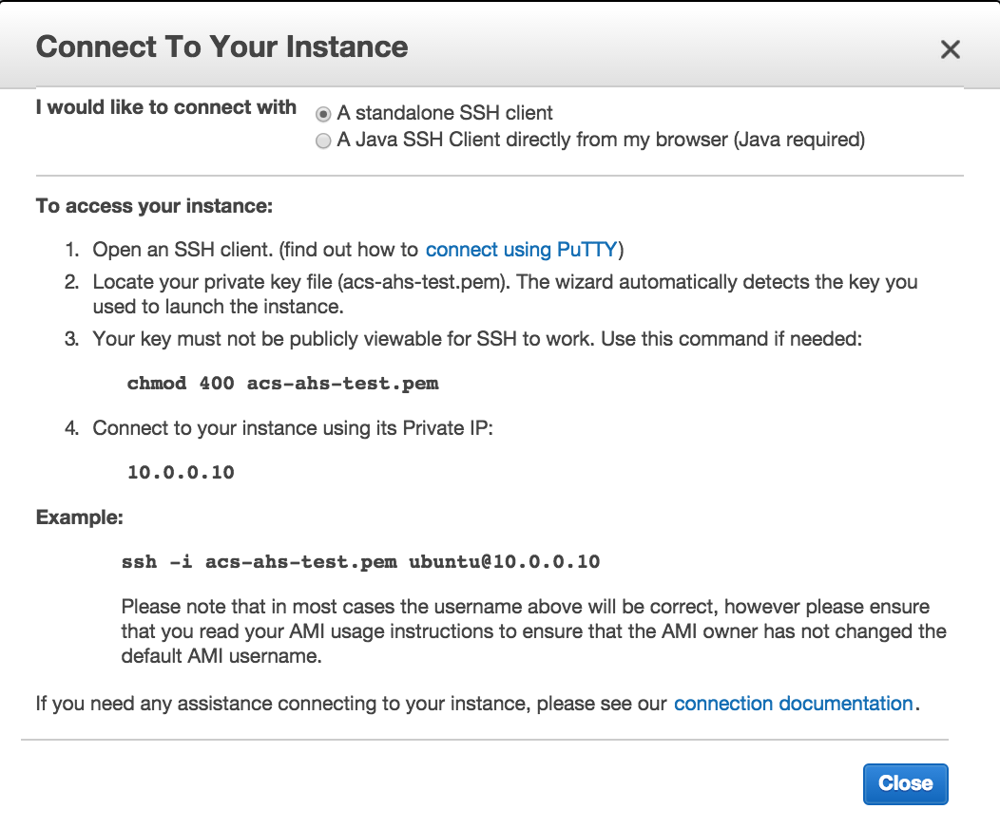
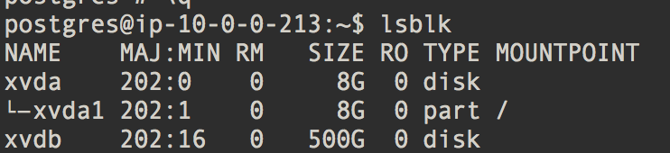
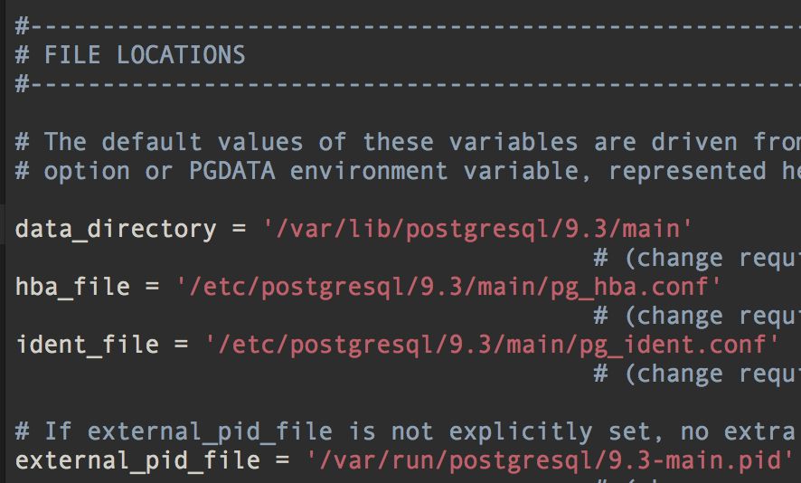
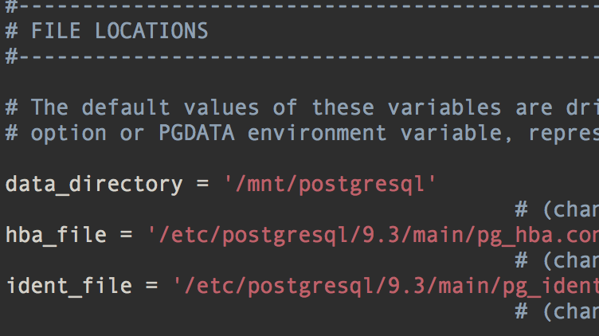

AHS <=> ACS
=======

This repository contains logic for mapping shared questions from the American Housing Survey (2011) and the American Community Survey (2013 5-year estimates) into a common schema.

## What ?

Many questions asked in the AHS directly mirror those asked in the ACS. For instance, both surveys ask about a respondent's age. While the ACS groups these responses into bucketed counts per block group (i.e. "Males under the age of 5" or "Females between the ages of 70 and 74"), the AHS simply records the respondent's actual age (4 or 72). While both surveys capture the same concept, they each record this information in different ways.  This project is an effort to enable translations between the two surveys by mapping these concepts into a common schema. This is useful as it allows models trained on AHS data to be scored on ACS data. For an example of such an application, check out [this project](http://github.com/enigma-io/smoke-alarm-risk).

## Why ?

Making the ACS-AHS merge a machine-readable process greatly enhances the value of the data in the American Housing Survey, and by extension, enriches what we can learn about a given few blocks within the biggest metro-areas in the U.S. We are [not](http://www.census.gov/content/dam/Census/programs-surveys/ahs/publications/CombiningAHS-ACS.pdf) [the](http://www.huduser.org/publications/pdf/comparison_hsg.pdf) [first](http://www.census.gov/housing/vacanciesfactsheet.html) to attempt a method for explaining the relationship between the two datasets. However, to the best of our knowledge, we have gone the farthest in making that process programmatic. 

## How ?

We came up with these mappings by scanning the [AHS Codebook](codebooks/ahs.pdf) for questions that were also asked in the ACS. For the most part, these were demographic variables and information about a respondent's household. While we tried to be as comprehensive as possible, it's entirely possible that some common concepts were missed (If you find any of these, please note so in this repository's [issue tracker](https://github.com/enigma-io/ahs-acs/issues)).

For each question the two surveys shared, we mapped the responses into a common schema. In the case of the AHS, responses are recorded in categories (i.e. "married" = 3 and "divorce" = 4), or continous numbers ("year house built" = 1964). On the other hand, as mentioned above, the ACS buckets responses by counts for census geographies like block groups and tracts. In order to map the two surveys, we had to similarly bucket AHS responses into binary indicators. Here's an example of what this process looks like for "Marital Status":

```yaml
- concept: Marital Status 
  ahs:
        type: categorical
        var: hhmar 
        map:
            hhmar_married_spouse_present: 1
            hhmar_married_spouse_absent: 2
            hhmar_widowed: 3
            hhmar_divorced: 4
            hhmar_separated: 5
            hhmar_never_married:  6
            
  acs:
        table: B12001
        total: B12001001
        map:
            hhmar_married_spouse_present: [B12001005,B12001014]
            hhmar_married_spouse_absent: [B12001006, B12001015]
            hhmar_widowed: [B12001009, B12001018]
            hhmar_divorced: [B12001010, B12001019]
            hhmar_separated: [B12001007, B12001016]
            hhmar_never_married: [B12001003, B12001012]
```

The above mapping represents instructions for translating rows from the AHS variable `hhmar` to columns in the ACS table `B12001`.  In the case of the AHS, we create new columns based on all possible response codes.  So, while the raw AHS column may look like this:

| hhmar |
|-------|
| 1     |
| 2     |
| 3     |
| 4     |
| 5     |
| 6     |

Our translated version would look like this:

| hhmar_married_spouse_present | hhmar_married_spouse_absent | hhmar_widowed | hhmar_divorced | hhmar_separated | hhmar_never_married |
|---|---|---|---|---|---|
| 1 | 0 | 0 | 0 | 0 | 0 |
| 0 | 1 | 0 | 0 | 0 | 0 |
| 0 | 0 | 1 | 0 | 0 | 0 |
| 0 | 0 | 0 | 1 | 0 | 0 |
| 0 | 0 | 0 | 0 | 1 | 0 |
| 0 | 0 | 0 | 0 | 0 | 1 |


The ACS, on the other hand, represents responses with multiple columns for faceted counts. In the particular case of marital status, the ACS groups responses by sex. As a result, we need to merge multiple columns into a single column. For instance, the column `B12001005` represents the count of males per census block who are married and whose spouses are present in their household. `B12001014` represents this same count for females.  By summing these two columns, we can generate a single count of people who are married with their spouse present per census block.  Finally, in order to normalize these counts to the same range as our transformed AHS table, we must divide them all by the `total` population of a census block. The resulting table might look something like this:

| hhmar_married_spouse_present | hhmar_married_spouse_absent | hhmar_widowed | hhmar_divorced | hhmar_separated | hhmar_never_married |
|----|----|----|----|----|----|
| .1 | .2 | .4 | .1 | .1 | .1 |
| .2 | .1 | .3 | .1 | .2 | .1 |
| .3 | .2 | 0  | .3 | 0  | .2 |
| .4 | .3 | .1 |  0 | .2 | 0  |
| .5 | .2 | 0  | .1 | .1 | .1 |
| .5 | .1 | .1 | .1 | .1 | .1 |

You can explore all of these mappings in [`ahs-acs.yaml`](ahs-acs.yaml).


## How do you handle missing data?

As described in the [AHS Codebook](codebooks/ahs.pdf), responses are missing for various reasons.  In these cases, we simply reflect the original missing data codes in our resulting transformation:

|column|
|------|
| -6   |
| -6   |
| 1    |
| 2    |


|column1|column2|
|-------|-------|
| -6    | -6    |
| -6    | -6    |
| 1     | 0     |
| 0     | 1     |


## Get the data.

If you'd like to download the resulting files of cross-tabluted variables for the AHS and ACS, you can access public versions of them here:

* [acs.csv ~ 2GB uncompressed](http://enigma-public.s3.amazonaws.com/projects/smoke-alarm-risk/data/acs.csv)
* [ahs.csv ~ 100MB uncompressed](http://enigma-public.s3.amazonaws.com/projects/smoke-alarm-risk/data/ahs.csv)

Or, if you want to access the raw PostgreSQL dumps of the ACS and AHS, you can find them here:

* [acs20135yr.sql ~ 13 GB compressed](http://enigma-public.s3.amazonaws.com/projects/ahs-acs/data/acs20135yr.sql.gz)
* [ahs2011.sql ~ 50MB compressed](http://enigma-public.s3.amazonaws.com/projects/ahs-acs/data/ahs2011.sql.gz)

Otherwise, if you'd like to re-run the queries to generate your own output, follow the instructions for doing so on AWS below:

## AWS Installation.

What follows is a quick tutorial for how to get an AWS instance up and running with the ACS 2013 5-year census along with the 2011 AHS. For those who are trying this process for the first time, be aware of [how Amazon prices servers](http://aws.amazon.com/ec2/pricing/).

#### 1. Spin up a fresh server:

You'll need to pick a box to spin up. Navigate to AWS's "Add Instance" tool and select an Ubuntu 14.0.4 box (this is the operating system and version with which we've run the work in this repo):





You'll want a pretty beefy instance with [EBS optimization](http://aws.amazon.com/ebs/) if you want the queries to execute quickly:





You'll also want to make sure to mount an EBS drive that's big enough to hold the entire ACS (150 GB is probably enough):




For the rest of the steps, you should just be able to follow the defaults. However, if you'd like to eventually access the ACS database from your local machine, make sure to open port 5432. If you're concerned about privacy, set it to only allow access to your machine's IP address:



Once your instance is launched, press the "Connect" button in the AWS EC2 Console and follow the instructions for ssh'ing into your instance:



Now that you've got a fresh box with enough storage to hold the entire ACS, let's install (PostgreSQL)[http://www.postgresql.org/].

#### 2. Mount your EBS drive:

First, run (lsblk)[http://manpages.courier-mta.org/htmlman8/lsblk.8.html] and check the output. You should see one drive that's a lot bigger than the others:



Create a filesystem on this drive:

```
sudo mkfs -t ext4 /dev/xvdb
```

Then, mount this drive onto a filepath on the local system, like `/mnt`:

```
sudo mount /dev/xvdb /mnt

```

#### 3. Install the requirements

Enter the following into the terminal of your remote server to get the latest updates for the system, the pre-reqs for PostgreSQL, and a Python yaml interpreter.

```bash
sudo apt-get update
sudo apt-get install postgresql postgresql-contrib postgresql-client-common
                     git python-pip
sudo pip install pyyaml
```

#### 4. Configure Postgres to store data to the mounted drive

First create a new directory under `/mnt` and make sure it's accessible to the user `postgres`:

```
sudo mkdir /mnt/postgresql
sudo chown postgres:postgres /mnt/postgresql
```

Next, use a text editing program in your terminal. We'll use vim. Open up the `postgresql.conf` file:

```
sudo vim /etc/postgresql/9.3/main/postgresql.conf
```

If you scroll down, you should see something like this:



Replace `data_directory` with your new variable and save the file. For non-vim users type `i` to insert text, `esc` to end insertion, and `:wq!` to save and quit.



Assume the role of the default `postgres` user:

``` 
sudo su postgres
```

Initialize a database under your new directory:

```
/usr/lib/postgresql/9.3/bin/initdb -D /mnt/postgresql
```

Now, exit from the postgres user role and restart PostgreSQL so that it can register the changes you made.

```
exit
sudo service postgresql restart
```

You should now be able to log into postgresql as the user `postgres` by entering:

```
sudo su postgres
psql
>>>psql (9.3.8)
>>>Type "help" for help.
>>>postgres=#
```

#### 5. Download the ACS + AHS files to your mounted drive

Now that you have an EBS-backed instance of PostgreSQL up and running, you should be ready to install the ACS and AHS tables.

First, make sure you're no longer registered as the `postgres` user:

```
exit
>>> ubuntu@ip-123.45.67.8:~$
```

Now, make a temporary directory on `/mnt` to store the data and make this directory publicly accessible:

```
sudo mkdir /mnt/tmp/
sudo chmod 777 /mnt/tmp/
```

You're now ready to download and uncompress the AHS and ACS tables. This will take a long time... approximately 1 hour.

```
wget http://enigma-public.s3.amazonaws.com/projects/ahs-acs/data/ahs2011.sql.gz
gunzip ahs2011.sql.gz
wget http://enigma-public.s3.amazonaws.com/projects/ahs-acs/data/acs20135yr.sql.gz
gunzip acs20135yr.sql.gz
```

#### 6. Restoring tables from downloaded backups.

Once these files finish downloading, you can set about restoring them as tables.

First, create the user and database associated with these tables:

```
psql -c "CREATE USER census PASSWORD 'censuspassword'; CREATE DATABASE census OWNER census;"
```

Now, restore the files:

```
pg_restore -C -d census ahs2011.sql
pg_restore -C -d census acs20135yr.sql
```

#### 7. (Last Step!) Generating AHS <=> ACS csvs.

First navigate back to your root directory and clone this repository:

```
cd
git clone https://github.com/enigma-io/ahs-acs.git
```

Navigate into this directory and make sure you can write to the output directory.

```
cd ahs-acs/
sudo chmod 777 data/
```

Now generate and execute the sql commands. This will take about 30-40 minutes:

```
python gen_acs_sql.py | psql -d census
python gen_ahs_sql.py | psql -d census
```

You should now have two files in your `data/` directory!
    
- `data/acs.csv` - ACS variables mapped to AHS variables.
- `data/ahs.csv` - AHS variables mapped to ACS variables.

